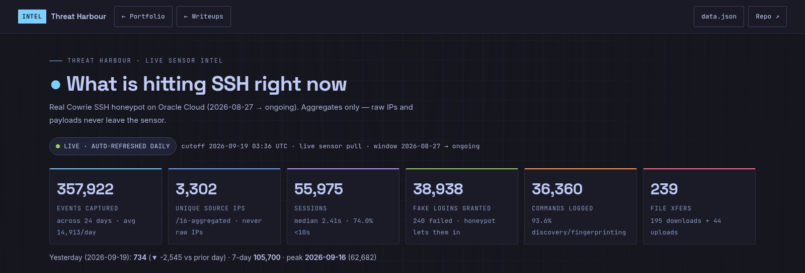
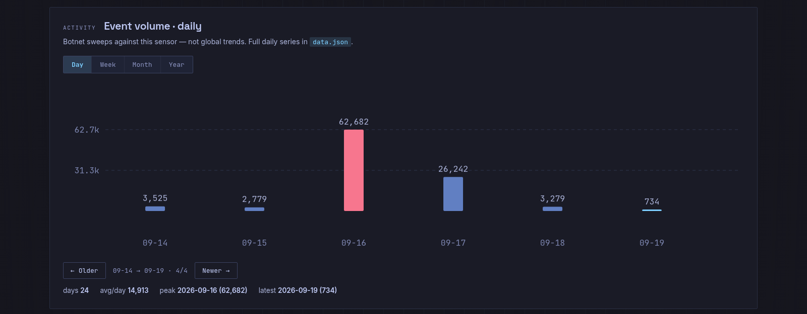
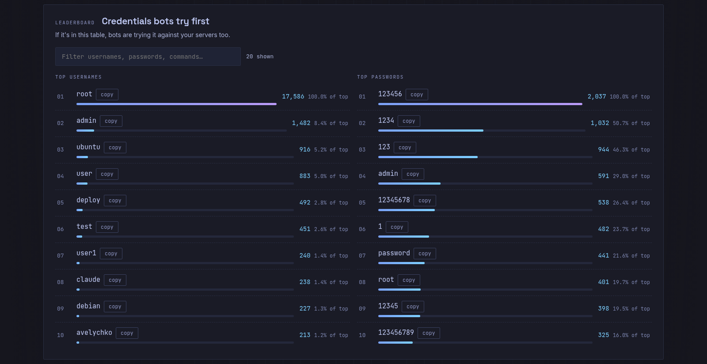
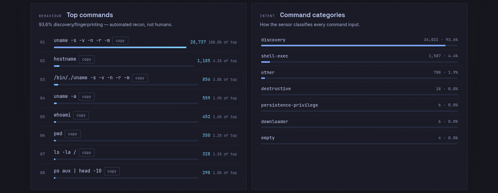
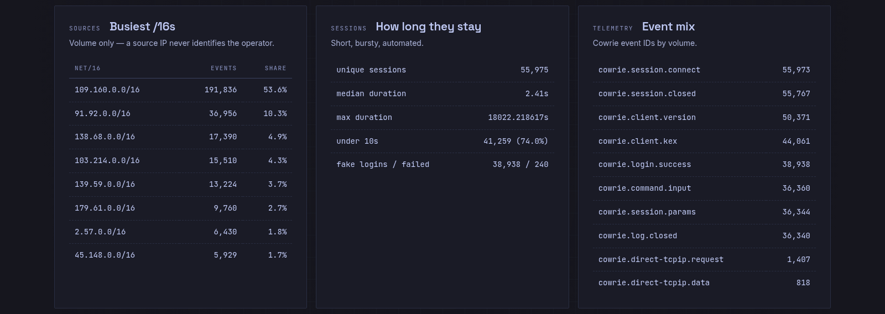
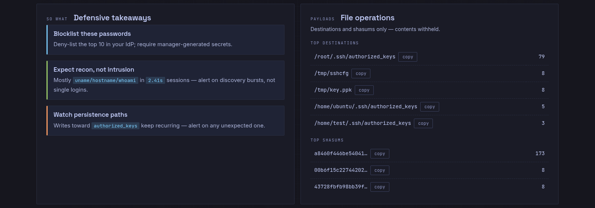
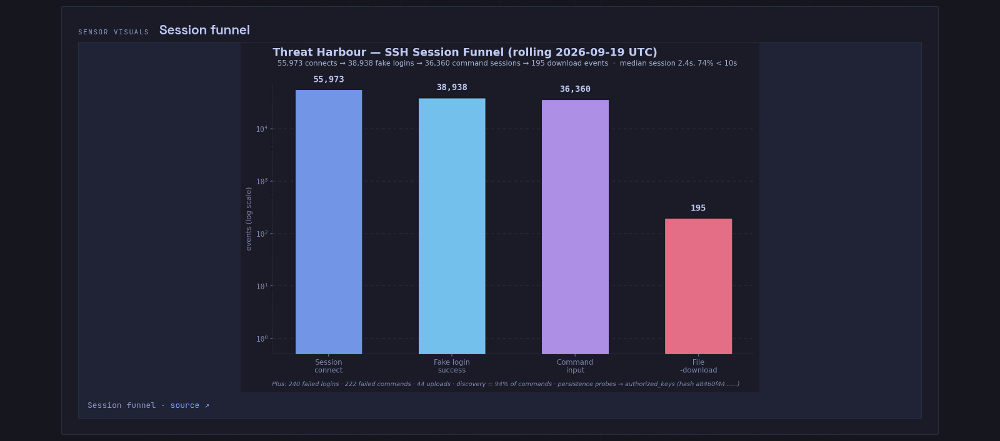
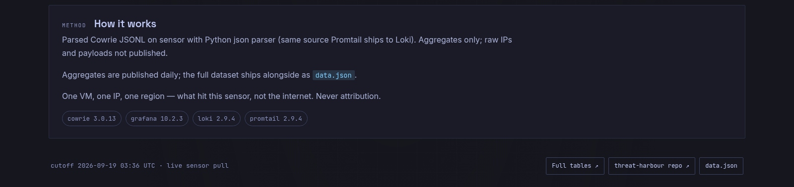

# Threat Harbour
## What credentials are attackers trying right now? Ask this box.

> A Cowrie SSH honeypot on Oracle Cloud Free Tier that publishes a **fresh leaderboard of real attacker credentials every 24 hours** — the usernames, passwords, and commands bots actually try against SSH servers in the wild.

> **Live site: [aaadarsh1337.github.io/intel](https://aaadarsh1337.github.io/intel)** — interactive charts + credential leaderboard, refreshed daily. No login required. Start there; this README is the data + method behind it.

## Why this exists

Every exposed SSH port on the internet gets knocked on thousands of times a day by bots working through credential lists. Most people still pick passwords from exactly the pool those bots try first. This repo closes that gap with live evidence: **if a password appears in the table below, bots are already trying it against your servers too.**

Use it to:

- Sanity-check password choices against what is actively being brute-forced.
- Justify MFA and password-manager adoption with real numbers, not theory.
- Teach brute-force attacks with a live specimen instead of slides.
- Feed blue-team awareness, blocklists, and detection ideas.

No attribution, no hype — just counts of what hit the sensor, refreshed daily.

<!-- METRICS:START -->
## Collected Data — refreshed every 24 hours (last run `2026-09-20 UTC`)

`2026-08-27` → `ongoing` · Cowrie `3.0.13` · SSH-only · `ap-hyderabad-1`.

| Total events | Unique IPs | Sessions | Fake logins | Commands | Downloads (+uploads) |
|---|---|---|---|---|---|
| `394,916` | `3,423` | `60,801` | `43,476` / 267 failed | `40,711` (+263 failed) | `224` (+48 uploads) |

| # | Top username | Top password | Top command |
|---|---|---|---|
| 1 | `root` (19,562) | `123456` (2,299) | `uname -s -v -n -r -m` (32,361) |
| 2 | `admin` (1,635) | `1234` (1,191) | `hostname` (1,263) |
| 3 | `ubuntu` (1,063) | `123` (1,075) | `/bin/./uname -s -v -n -r -m` (945) |
| 4 | `user` (1,027) | `admin` (672) | `export PATH=/usr/local/sbin:/usr/local/b…` (722) |
| 5 | `deploy` (572) | `12345678` (604) | `uname -a` (617) |

Key findings:

- Median session `2.4s` (75% under 10s) — mostly automated scanning, not humans.
- `94%` of commands are discovery/fingerprinting (`uname`, `hostname`, `whoami`).
- Repeated persistence probes writing toward `authorized_keys` (hash `a8460f44……`, content withheld).
- Busiest /16 by volume: `109.160.0.0/16` (220,884 events) — volume only, never attribution.

Method + full tables: [`analysis/summary.md`](analysis/summary.md), [`analysis/metrics.json`](analysis/metrics.json). These results describe this sensor only.
<!-- METRICS:END -->

## How it stays fresh

A GitHub Actions job runs **every 24 hours**: it SSHes into the sensor as a restricted read-only user, parses the Cowrie logs on the box, and commits the updated tables and charts back here. Only aggregates ever leave the sensor — raw logs, source IPs, and payloads stay on it. Details in [`docs/operations.md`](docs/operations.md); pipeline in [`scripts/`](scripts/).

## Architecture

*Internet → OCI edge → NSG → Sensor VM (Cowrie + localhost-bound monitor stack) → analyst via SSH tunnel. Grafana/Loki are never public; raw logs stay on sensor.*

*Same Cowrie JSONL feeds Loki dashboards and the reproducible offline parse. Diagram sources render with `dot -Tpng -Gdpi=150`.*

One Free Tier VM (`VM.Standard.E2.1.Micro`, Ubuntu 24.04, `ap-hyderabad-1`): SSH-only Cowrie `3.0.13`, plus Grafana + Loki + Promtail over Docker, all localhost-bound. Deliberately small instead of a full multi-service setup like T-Pot — one port, tight scope, rebuildable. See [docs/architecture.md](docs/architecture.md).

## Live stats (public)

Public stats site: [aaadarsh1337.github.io/intel](https://aaadarsh1337.github.io/intel) — charts + credential leaderboard from the same aggregates. Separate from the operator Grafana below; no login required.

*Layout reference captured 2026-09-19 — numbers refresh daily on the site itself; shots below refresh only when the site layout changes.*

## Local dashboard (Grafana, operator-only)

Local Grafana view (tables of logins, commands, top IPs, top credentials, localhost-only via SSH tunnel). Not public. See [dashboard/README.md](dashboard/README.md).

## Limitations

One VM, one IP, one region — this is what hit *this* sensor, not the whole internet. A source IP never identifies the operator. Cowrie's emulation shapes what gets recorded. Full statement in [docs/limitations.md](docs/limitations.md).

The project does not identify attackers, attribute activity to any country or organization, stop attacks, or prove anything about who operates a source IP.

## Ethical use

Defensive research and education only. Published data is aggregate and redacted — no private keys, personal information, malware samples, or infrastructure identifiers.

## Documentation

- [Threat intelligence](docs/threat-intelligence.md) — deep-dive findings per cutoff
- [Research methodology](docs/research-methodology.md)
- [Deployment](docs/deployment.md)
- [Hardening](docs/hardening.md)
- [Operations](docs/operations.md) (incl. automation)
- [Incident response](docs/incident-response.md)
- [Limitations](docs/limitations.md)
- [Dashboard design](dashboard/README.md)
- [Changelog](CHANGELOG.md)

## Acknowledgments

Sensor design, cloud deployment, hardening, and analysis direction are my own
work. AI assistance was used for documentation drafting and the automation
scripts (`scripts/`, workflow) — every metric published here comes from real
sensor logs, not generated content.

## Licensing

No license file: portfolio and research documentation project, all rights reserved by default. Cowrie and dependencies keep their own licenses.
