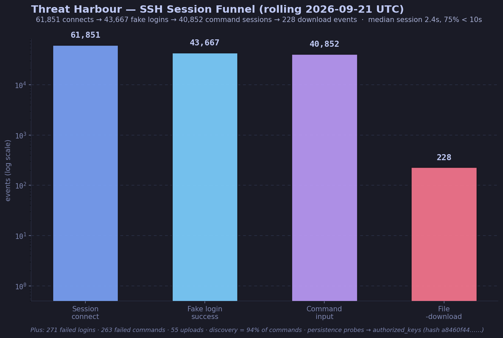
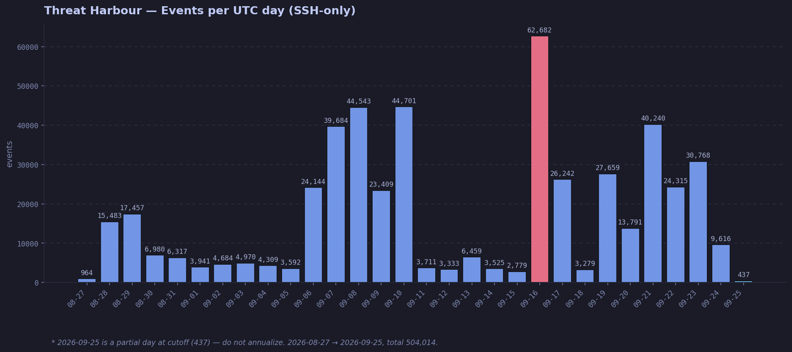
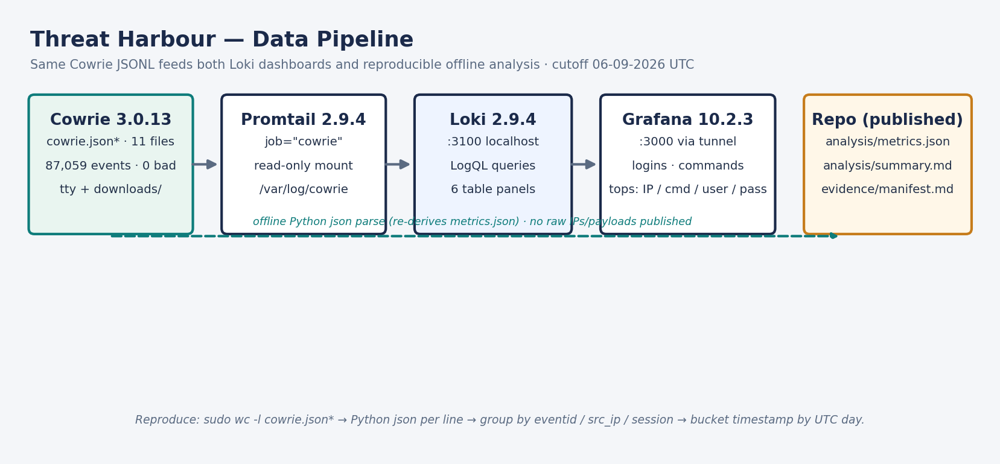

# Threat Harbour
## A Cowrie-Based Cloud Threat Intelligence Sensor

> A lightweight Cowrie SSH honeypot sensor on Oracle Cloud Infrastructure Free Tier for defensive security research. I usually do red teaming — this is my look at the other side: what actually hits an exposed box on the internet.

## Collected Data — interim, frozen `06-09-2026 UTC` (sensor still running)

`27-08-2026` → `ongoing` · Cowrie `3.0.13` · SSH-only · `ap-hyderabad-1`.

| Total events | Unique IPs | Sessions | Fake logins | Commands | Downloads (+uploads) |
|---|---|---|---|---|---|
| `87,059` | `1,876` | `17,102` | `7,404` / 81 failed | `6,521` (+67 failed) | `66` (+5) |

| # | Top username | Top password | Top command |
|---|---|---|---|
| 1 | `root` (3,311) | `123456` (461) | `uname -s -v -n -r -m` (4,692) |
| 2 | `admin` (342) | `1234` (234) | `hostname` (249) |
| 3 | `user` (230) | `123` (230) | `uname -a` (151) |
| 4 | `ubuntu` (191) | `12345678` (130) | `whoami` (122) |
| 5 | `test` (138) | `admin` (117) | `pwd` (101) |

Key findings:

- Median session `8.4s` (52% under 10s) — mostly automated scanning, not humans.
- `91%` of commands are discovery/fingerprinting (`uname`, `hostname`, `whoami`).
- Repeated persistence probes writing toward `authorized_keys` (hash `a8460f44…`, content withheld).
- Busiest /16 by volume: `91.92.0.0/16` (36,956 events) — volume only, never attribution.

Method + full tables: [`analysis/summary.md`](analysis/summary.md), [`analysis/metrics.json`](analysis/metrics.json). These results describe this sensor only.

## Executive Summary

This project operates a deliberately exposed Cowrie honeypot sensor in `ap-hyderabad-1`. It records unsolicited authentication attempts, commands, sessions, downloads, and related connection metadata for a defined observation period. 
  
The deployment is intentionally lightweight. Because the OCI Free Tier VM has limited CPU, memory, storage, and network resources, this project uses Cowrie rather than a full multi-service like T-Pot.  
  
The sensor focuses on SSH interaction, operational reliability, careful data collection, and reproducible analysis instead of running every available honeypot service. The deployment is isolated from production systems and does not contain personal data, production workloads, credentials, private keys, or sensitive information. 

## Objectives

- Deploy and operate a public-facing Cowrie honeypot.
- Practice cloud networking and host hardening.
- Measure unsolicited SSH activity.
- Build a resource-conscious collection and analysis pipeline.
- Produce reproducible, redacted threat-intelligence observations.
- Document expected honeypot activity separately from possible host compromise.

## Architecture

One OCI VM in a public subnet: SSH-only Cowrie plus localhost-bound logging and dashboard components (reached via SSH tunnel, never public). See [docs/architecture.md](docs/architecture.md).

## Technology Stack

| Layer | Technology |
|---|---|
| Cloud | Oracle Cloud Infrastructure Free Tier |
| Region | `ap-hyderabad-1` |
| Compute shape | `VM.Standard.E2.1.Micro` |
| Operating system | `Canonical Ubuntu 24.04` |
| Honeypot | Cowrie `3.0.13` (venv) |
| Monitoring | `Docker`: Grafana + Loki + Promtail |
| Collection | Cowrie JSONL (`job=cowrie` via Promtail/Loki; offline Python parse) |
| Administration | `SSH restricted to private-key holders only` |
| Time standard | UTC |

## Resource-Constrained Design

This is not a full-fledged all-services honeypot. The Free Tier VM imposes resource limitations that affect the design:

- Limited memory for containers and analytical services
- Limited CPU for simultaneous collection and visualization
- Limited local storage for logs and downloaded artifacts
- One public IP and one observation location
- Possible service degradation during high-volume scanning

To reduce resource pressure, the deployment prioritizes:

- Cowrie SSH interaction
- JSONL logging
- Log rotation and retention
- Offline analysis
- Restricted dashboard access
- Rebuildability over long-term local accumulation

## Dashboard

The dashboard displays (tables-only, matching `grafana-dashboard.json`):

- Login attempts
- Commands executed
- Top attacking source IPs by volume
- Top commands
- Top usernames
- Top passwords

See [dashboard/README.md](dashboard/README.md).

## Ethical Use

This project is intended for defensive security research, education, and controlled observation.

The sensor must not be used to attack, scan, exploit, or access systems without authorization. Published data must be redacted and should not expose credentials, private keys, personal information, malware samples, or unnecessary infrastructure identifiers.

## Limitations

This project uses one VM, one public IP, and one OCI region. Results are affected by sensor placement, Cowrie's emulation behavior, Internet scanning patterns, resource limits, logging gaps, and the observation period.

The project does not:

- Identify attackers
- Establish operator identity or intent
- Attribute activity to a country or organization
- Stop attacks
- Represent all Internet activity
- Prove that a source IP belongs to the person operating the activity

A source IP does not establish the identity, physical location, or intent of the operator.

See [docs/limitations.md](docs/limitations.md).

## Documentation

- [Architecture](docs/architecture.md)
- [Deployment](docs/deployment.md)
- [Hardening](docs/hardening.md)
- [Operations](docs/operations.md)
- [Incident response](docs/incident-response.md)
- [Threat intelligence](docs/threat-intelligence.md)
- [Research methodology](docs/research-methodology.md)
- [Limitations](docs/limitations.md)
- [Dashboard design](dashboard/README.md)
- [Changelog](CHANGELOG.md)

## Licensing

No license file is included: this is a portfolio and research documentation project, all rights reserved by default.

Third-party software, including Cowrie and its dependencies, retains its own licenses. This repository does not relicense Cowrie or any third-party component.
