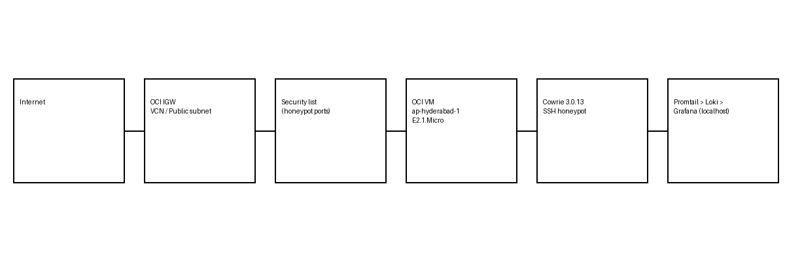
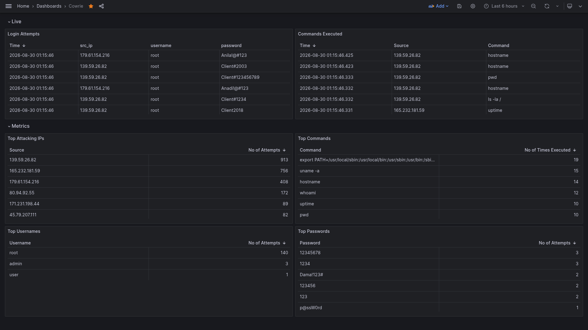

# Threat Harbour
## A Cowrie-Based Cloud Threat Intelligence Sensor

Hello Hackers!  

Today, I will be trying out something new. Usually I am all about red teaming, CTF's and breaking into stuff (legally of course)  

But today, I've decided to spin up my own honeypot, using Cowrie, to learn more about the other side of the game.   

We will analyze what happens to our instance on internet, which will provide us an insight on how attackers think and work.   

> A lightweight Cowrie SSH/Telnet honeypot sensor deployed on Oracle Cloud Infrastructure Free Tier for defensive security research.

## Executive Summary

This project operates a deliberately exposed Cowrie honeypot sensor in `ap-hyderabad-1`. It records unsolicited authentication attempts, commands, sessions, downloads, and related connection metadata for a defined observation period. 
  
The deployment is intentionally lightweight. Because the OCI Free Tier VM has limited CPU, memory, storage, and network resources, this project uses Cowrie rather than a full multi-service like T-Pot.  
  
The sensor focuses on SSH/Telnet interaction, operational reliability, careful data collection, and reproducible analysis instead of running every available honeypot service. The deployment is isolated from production systems and does not contain personal data, production workloads, credentials, private keys, or sensitive information. 

## Objectives

- Deploy and operate a public-facing Cowrie honeypot.
- Practice cloud networking and host hardening.
- Measure unsolicited SSH/Telnet activity.
- Build a resource-conscious collection and analysis pipeline.
- Produce reproducible, redacted threat-intelligence observations.
- Document expected honeypot activity separately from possible host compromise.

## Architecture

The architecture consists of one OCI VM in a public subnet. The VM hosts the
operating system, Cowrie, logging, local analysis utilities, and optional
dashboard components.

See [docs/architecture.md](docs/architecture.md).

## Technology Stack

| Layer | Technology |
|---|---|
| Cloud | Oracle Cloud Infrastructure Free Tier |
| Region | `ap-hyderabad-1` |
| Compute shape | `VM.Standard.E2.1.Micro` |
| Operating system | `Canonical Ubuntu 24.04` |
| Honeypot | Cowrie `3.0.13` |
| Runtime | `Docker` |
| Collection format | Cowrie JSON logs parsed via Loki |
| Dashboard | `Grafana + Loki` |
| Administration | `SSH restricted to private-key holders only` |
| Time standard | UTC |

## Resource-Constrained Design

This is not a full-fledged all-services honeypot. The Free Tier VM imposes resource limitations that affect the design:

- Limited memory for containers and analytical services
- Limited CPU for simultaneous collection and visualization
- Limited local storage for logs and downloaded artifacts
- One public IP and one observation location
- Possible service degradation during high-volume scanning

To reduce resource pressure, the deployment prioritizes:

- Cowrie SSH/Telnet interaction
- JSONL logging
- Log rotation and retention
- Offline analysis
- Restricted dashboard access
- Rebuildability over long-term local accumulation

## Observation Scope

Observation period: `27-08-2026` to `ongoing` (interim analysis frozen at `06-09-2026 UTC`).

The sensor records activity directed at intentionally exposed Cowrie services. It does not scan external systems, initiate attacks, or attempt to identify operators.

## Results (interim, frozen at `06-09-2026 UTC`; sensor still running)

- Total events: `87,059`
- Unique source IPs: `1,876`
- SSH sessions: `17,102`
- Telnet sessions: `0` (no Telnet events observed; SSH-only in this window)
- Successful fake logins: `7,404`
- Commands observed: `6,521` command-input events
- Download attempts: `66` (+5 uploads)
- Observation continuity: daily log files for every day `27-08-2026` through `06-09-2026`, no missing days (uptime % not claimed)

See `analysis/summary.md` and `analysis/metrics.json` for method and full tables.

These results describe this sensor only. They do not represent all Internet activity.

## Dashboard

The dashboard displays (tables-only, matching `grafana-dashboard.json`):

- Login attempts
- Commands executed
- Top attacking source IPs by volume
- Top commands
- Top usernames
- Top passwords

See [dashboard/README.md](dashboard/README.md).

## Ethical Use

This project is intended for defensive security research, education, and controlled observation.

The sensor must not be used to attack, scan, exploit, or access systems without authorization. Published data must be redacted and should not expose credentials, private keys, personal information, malware samples, or unnecessary infrastructure identifiers.

## Limitations

This project uses one VM, one public IP, and one OCI region. Results are affected by sensor placement, Cowrie's emulation behavior, Internet scanning patterns, resource limits, logging gaps, and the observation period.

The project does not:

- Identify attackers
- Establish operator identity or intent
- Attribute activity to a country or organization
- Stop attacks
- Represent all Internet activity
- Prove that a source IP belongs to the person operating the activity

A source IP does not establish the identity, physical location, or intent of the operator.

See [docs/limitations.md](docs/limitations.md).

## Documentation

- [Architecture](docs/architecture.md)
- [Deployment](docs/deployment.md)
- [Hardening](docs/hardening.md)
- [Operations](docs/operations.md)
- [Incident response](docs/incident-response.md)
- [Threat intelligence](docs/threat-intelligence.md)
- [Research methodology](docs/research-methodology.md)
- [Limitations](docs/limitations.md)
- [Dashboard design](dashboard/README.md)
- [Changelog](CHANGELOG.md)

## Licensing

No license file is included: this is a portfolio and research documentation project, all rights reserved by default.

Third-party software, including Cowrie and its dependencies, retains its own licenses. This repository does not relicense Cowrie or any third-party component.
